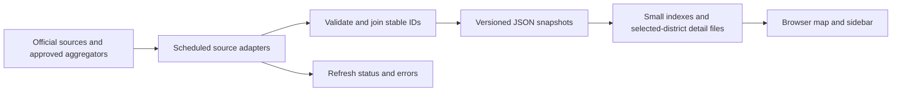

# Voting, elections, and federal map expansion

Exploration dated September 26, 2026. The existing state map performance changes
are implemented. A first Congress slice is now available at `/congress`: 119th
House shapes, state shapes for Senate, official officeholders, and the ten
latest recorded rolls per chamber in a dated local snapshot. The refresh is
manual. State votes, broader election results, upcoming elections, polls, and
a current-representation/election-plan comparison remain proposed.
Washington's ten 2024 U.S. House general-election contests are now a pilot in
the Congress Elections tab. Other election results remain proposed.

## What the interface would look like

Keep the current map and sidebar. Add a **State / Federal** control above the
existing **House / Senate** switch. Add sidebar tabs after selecting a district:

| Tab | Contents |
| --- | --- |
| People | Current members, official links, term dates, source freshness |
| Recorded votes | Recent roll calls for each member, bill/motion, date, position, chamber result, original source |
| Elections | Next scheduled contest and previous results, with separate primary/general/special elections |
| Polls | Individual relevant polls, field dates, population/sample, sponsor, methodology link, missing-data message |

For **U.S. House**, load a separate congressional-district PMTiles archive. For
**U.S. Senate**, draw states and show both senators; each seat has its own term
and election schedule. The Senate map needs state geometry, not state-senate
district geometry. Preserve the existing 50-state scope.

Offer a separate **Current representation / Election map** view. A newer
election plan must not move a currently serving member onto a future district.
The [House's representation lookup](https://www.house.gov/representatives/find-your-representative)
explains this distinction. A source probe also found 120th-Congress boundaries
above 119th-Congress boundaries in the current [Census service](https://tigerweb.geo.census.gov/arcgis/rest/services/TIGERweb/Legislative/MapServer?f=pjson):
select by the intended Congress, never by an assumed layer number.
In the 119th-Congress BAS 2026 layer, a live query found 438 features in the
50 states: 435 represented districts and three `ZZ` areas where a congressional
district is not defined. Exclude `ZZ` from seat counts and officeholder joins.

Useful interactions: shareable selection URLs, a bill filter, an election-year
selector, and a compare-members view for two senators or a multi-member state
district. Keep historical results in the sidebar until a correct historical
boundary crosswalk exists.

## Low-cost refresh design



Run Python adapters on this machine through a scheduled task when ready. Serve
their cached JSON through the existing app. This uses the current host and
avoids a paid tunnel, database, or a third-party API request on every hover.
Hosting/API quotas still depend on the eventual deployment and providers.

Suggested initial cadence (product choices, not provider guarantees):

- Federal roll calls: every 30–60 minutes while Congress is sitting; daily otherwise.
- State roll calls: daily where an API supports it; label monthly bulk imports as monthly snapshots.
- Election schedules and candidate lists: daily, plus targeted checks when dates change.
- Historical certified results: import by election; recheck for corrections.
- Unofficial live returns: only add after a state-specific source supports it, at that source's publication cadence.
- Poll releases: daily discovery; validate race, methodology, and permitted reuse before publication.

Every snapshot needs the original URL, retrieved time, source update time where
available, coverage status, and content hash. Use conditional HTTP requests
when supported, bounded retries/backoff, and atomic writes. A failed refresh
keeps the last good snapshot and displays its age. Nothing is labeled real time
unless its actual publication and refresh behavior supports that claim.

## Data relationships that must be explicit

- **Person and term:** join votes through stable person IDs and the term at the
  time of the vote. Names alone are insufficient. House XML uses Bioguide IDs;
  Senate XML uses LIS IDs; state data uses Open States/official identifiers.
- **District plan and seat:** preserve office, state, district code, plan/version,
  effective dates, and seat position/class. Washington's two state House
  positions share geography but have separate elections.
- **Vote event:** key by jurisdiction, chamber, session, and roll-call number.
  Preserve the motion and type: a procedural or quorum vote is not necessarily
  a vote to pass a bill. Missing records differ from an explicit "not voting".
- **Election contest:** key by election date, stage, office, district plan, seat,
  and special-election identity. Preserve write-ins and certification status;
  ranked-choice rounds and multi-seat rules need dedicated handling.
- **Poll:** attach to a particular race and stage. Preserve field dates,
  pollster/sponsor, sample/population, mode, and the reported uncertainty type.
  A national generic-ballot poll must not become a district estimate.

## Source feasibility

| Capability | Evidence and next requirement |
| --- | --- |
| Federal roll calls | Official Senate and House list/detail XML returned HTTP 200 without keys; reusable probe finds each latest listed roll. Member-ID crosswalk and backfill remain. |
| State roll calls | Open States API requires a key; session bulk downloads provide another path. Test individual-member coverage state by state. |
| Election history | Washington's official 2024 CSV returned HTTP 200 and includes state legislative positions and federal contests; reusable pilot added. Other states need adapters. |
| Upcoming elections | Use state election authorities, with current FEC federal calendar as a discovery aid. Static calendars become stale and primaries can vary by district within a state. |
| Polling | A recent primary-source release supplies enough metadata for a card; one checked schema example is saved. A complete, licensed, automatically refreshed feed has not been established. |

### Reproduce the source probes

From `state-rep-backend`, with Python 3.12 or newer:

```bash
python -m state_rep_map_builder.probe_federal_sources --output /tmp/federal-source-probe.json
python -m state_rep_map_builder.probe_wa_results --output /tmp/wa-2024-results-probe.json
```

The federal probe fetches each chamber's latest listed roll call and counts
50-state congressional shapes with/without `ZZ`. Pass `--house-roll 1` for a
fixed, clearly labeled House example.
The Washington probe reads the official 2024 general-election CSV. The pilots
write atomically and retain source URLs, timestamps, and SHA-256 hashes. The
federal probe remains separate from the `/congress` snapshot refresh. The
Washington probe does not populate the app. Neither process is scheduled yet.
A House or Senate source may be absent during a new session; a failed refresh
keeps an existing output.

Live checks on September 26, 2026: the [House Clerk index](https://clerk.house.gov/evs/2026/index.asp)
led to roll 314 (September 16; 433 individual vote rows and matching tally);
the [Senate vote list](https://www.senate.gov/legislative/LIS/roll_call_lists/vote_menu_119_2.xml)
led to roll 244 (September 24; 100 rows and matching tally). The Census count
was 435 represented districts plus three `ZZ` areas. Washington's export gave
134 contests: 98 state House seat positions, 25 state Senate districts, ten
U.S. House districts, and one statewide U.S. Senate contest. The live CSV's
SHA-256 matched the independently downloaded fixture. These checks verify
retrieval and parsing; they do not establish a national election-history feed.
The reviewed outputs are saved as a [federal source example](examples/federal-source-probe-2026-09-26.json)
and a [Washington election example](examples/wa-2024-election-probe-2026-09-26.json).
These files are dated probe snapshots, not automatically refreshed app data.

Primary-source research and qualifications are in [voting-history.md](voting-history.md)
and [elections-and-federal.md](elections-and-federal.md). The Washington feed is
linked from its [official export page](https://results.vote.wa.gov/results/20241105/export.html).
The polling schema example comes from [Emerson's Michigan release](https://emersoncollegepolling.com/michigan-2026-poll-el-sayed-and-rogers-locked-in-close-election/),
fielded September 12–14, 2026. It reports a credibility interval; the example
preserves that wording and does not assume that the listed responses are complete.
See [poll-example.json](poll-example.json). This is a feasibility sample, not a poll average or a forecast.

## Recommended build order

1. Done for the 119th Congress: official roster crosswalk and
   current-representation House/state PMTiles layers, with fast highlighting.
   A durable term history and automated boundary rollover remain to build.
2. Done for the latest ten federal rolls per chamber: a **Recorded votes** tab.
   Add one state legislature as a coverage pilot before scaling to 50.
3. Washington's 2024 U.S. House pilot is done with the 119th district plan.
   Add the state legislative contests with explicit seat positions and
   boundary vintage. Add upcoming election links/dates with source freshness.
4. Expand state adapters according to measured coverage; add curated polling
   cards for supported races. Consider an aggregated polling feed after source
   coverage and reuse terms are settled.

Acceptance checks: both senators appear independently; same-number state/federal
districts never mix; future plans never replace current representation; old
elections retain their original plan; delayed refreshes cannot erase data;
write-ins and seat positions survive imports; absent polls remain absent; and
adding history never increases hover latency or loads national vote history on
initial page load.
